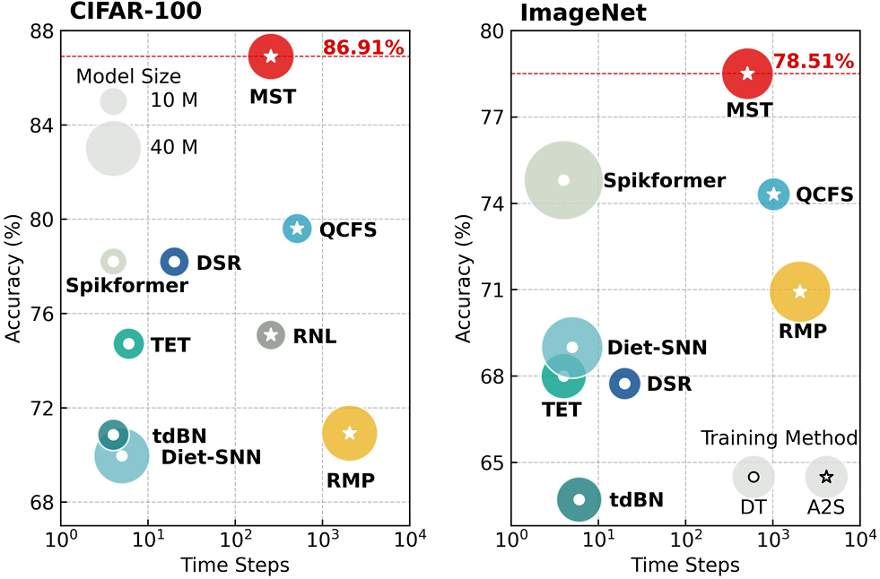
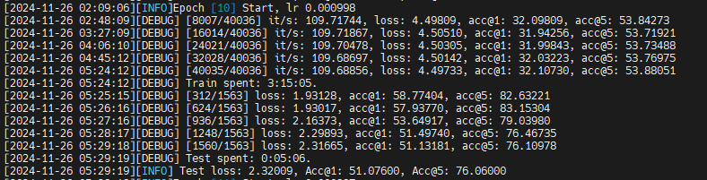

# SNN项目复现与探索研究报告

## 一、研究背景

​	随着深度学习的发展，传统的人工神经网络（Artificial Neural Networks, ANNs）在多个领域内取得了显著成效，如图像分类、自然语言处理等。然而，尽管ANN网络表现优异，但在实际应用中仍然面临着高能耗的问题。由于ANN模型通常需要大量的乘加运算以及频繁地数据存储和访问，这些操作导致了巨大的能量消耗和计算资源需求，在大规模网络的情况下这种消耗尤为明显。

​	为了应对这一挑战，脉冲神经网络（Spiking Neural Networks, SNNs）作为一种受生物启发的神经网络架构，凭借其独特的计算方式，逐渐成为高效能计算的有力解决方案。SNN采用事件驱动的计算机制，利用脉冲（Spike）代替传统的连续值进行信息传递。其核心是脉冲神经元模型，通过累积来自突触前神经元的脉冲并在膜电位达到阈值时发放脉冲，进行信息处理。这种脉冲驱动的计算方式使得SNN能够有效降低计算资源的消耗。

​	不过SNN虽然在能效方面具有明显优势，但在训练过程中存在梯度消失问题，这使得传统的反向传播（Backpropagation Algorithm）算法难以直接应用到SNN中。因此，如何结合SNN的低能耗特性，同时解决其训练中遇到的优化问题，成为了当前学术界和工业界的研究热点。

​	在此背景下，本文基于SpikingJelly框架，设计并复现了一个基于SNN的图像分类模型，并对CIFAR-10数据集进行了测试，展示了其在低能耗下的高效分类能力。同时，我们进一步探索了SNN与Transformer架构的结合，复现了Spikingformer、Spike-driven Transformer、SpikingResformer等模型，并在多个数据集上进行了全面的对比实验。本文将详细介绍我们的实验过程、技术实现、实验结果以及对SNN的未来发展方向的展望。

## 二、基于 SpikingJelly 的 CIFAR-10 分类器构建

### 2.1 实验目的及参数、结构

​	为了学习和探索SNN，我们期望通过搭建一个SNN分类器，体验其在图像分类任务中的性能与能耗表现，比较其与传统神经网络不同之处来初步了解SNN包括脉冲发放机制、脉冲神经元模型实现，以及脉冲驱动计算在内的基本工作原理。

​	本次实验中，我们选用 SpikingJelly 框架和 CIFAR-10 数据集，利用卷积的 SNN 架构，将激活函数替换为能体现脉冲特性的IF（Integrate-and-Fire）神经元函数，再通过代理梯度方法训练神经网络。经检验，该网络能处理时间相关信息并有较高准确率（90.31%）。

​	网络结构组成：
```python
1. Multiple ConvBlock layers (Conv2D + BatchNorm + IF Neuron)
2. MaxPooling layers for dimensionality reduction
3. Fully connected layers for classification
4. Uses IF (Integrate-and-Fire) neurons with ATan surrogate gradient
```

​	模型参数：
```python
1. Simulation timesteps (T): 4
2. Learning rate: 1e-3
3. Optimizer: Adam
4. Learning rate scheduler: CosineAnnealing
5. Batch size: 128
```

​	整体架构：
```python
ConvBlock(3, 128) -> ConvBlock(128, 128) -> MaxPool2d(2, 2)
-> ConvBlock(128, 256) -> ConvBlock(256, 256) -> MaxPool2d(2, 2)
-> ConvBlock(256, 512) -> ConvBlock(512, 512) -> MaxPool2d(2, 2)
-> Flatten -> Linear(512*4*4, 1024) -> IFNode(surrogate.ATan()) -> Linear(1024, 10)
```

​	ConvBlock架构：
```python
Conv2d(in_channels, out_channels) -> BatchNorm2d(out_channels) -> IFNode(surrogate.ATan())
```

### 2.2 实验结果展示


<div align="center" style="color:#C0C0C0; text-decoration: underline;">图1. CIFAR-10 数据集下SNN分类器训练损失</div>

<div align=center>

</div>

<div align="center" style="color:#C0C0C0; text-decoration: underline;">图2. CIFAR-10 数据集下SNN分类器测试准确率</div>

<div align=center>

</div>
<div align="center" style="color:#C0C0C0; text-decoration: underline;">图3. CIFAR-10 数据集下SNN分类器测试损失</div>


​	通过调研发现，SNN在小规模网络上能够实现高准确度，但在大规模深度神经网络中常会有准确率较低的缺陷。如何将SNN运用在大规模深度神经网络如Transformer上是一个热门方向。接下来，我们将通过学习与复现多篇该领域的最新工作探究这一问题。

## 三、Spikingformer 复现与学习

### 3.1 文章简介

​	脉冲神经网络（SNNs）因其事件驱动的计算特性和在神经形态硬件上的低功耗优势，被视为人工神经网络（ANNs）的高效替代方案。然而，目前的深度SNNs（如Spikformer和SEW ResNet）由于残差连接结构中引入了非脉冲计算（如整数-浮点乘法），显著增加了功耗，并限制了其在神经形态硬件上的部署性能。

​	为解决上述问题，一种硬件友好的脉冲驱动残差学习（Spike-driven Residual Learning）架构被提出，用于避免非脉冲计算。在此基础上Spikingformer提出了一种全新的、纯粹基于变换器的SNN模型。该模型通过完全事件驱动的设计优化了功耗，同时提升了性能。模型的整体框架流程如图 4 所示。


<div align="center" style="color:#C0C0C0; text-decoration: underline;">图4. Spikingformer的整体流程框架图</div>

​	Spikingformer 的整体架构是一个完全基于Transformer的纯脉冲神经网络 (SNN)，架构主要包括以下组件：

1. **Spiking Tokenizer**：将输入图像转化为序列化的脉冲表示。
2. **Spiking Transformer Blocks**：一系列事件驱动的变换器块，分别用于提取图像的局部和全局特征。
3. **分类头 (Classification Head)**：用于将变换器提取的特征映射为分类输出。

​	整个模型的主要流程如下：

- 输入图像通过 **Spiking Tokenizer** 被编码为脉冲事件。
- 编码后的脉冲事件传递到多个级联的 **Spiking Transformer Blocks** 中。
- 最终由分类头对输出的特征进行分类。

### 3.2 核心模块

#### 3.2.1 Spiking Tokenizer

​	Spiking Tokenizer 的目的是将输入图像转化为脉冲序列，作为后续变换器块的输入。它主要分为两个步骤：

1. **空间降维**：通过脉冲卷积层 (Spiking Conv Layer) 提取局部空间特征。
2. **序列化**：将降维后的特征映射到序列表示。

​	假设输入图像为 $I \in \mathbb{R}^{H \times W \times C}$ ，通过 Spiking Tokenizer 处理后得到脉冲特征表示为 $X\in \mathbb{R}^{T \times N \times D}$，其中  $H$ 和  $W$  是输入图像的高和宽， $C$  是通道数， $T$  是脉冲的时间步长， $N$  是序列长度， $D$  是特征维度。

​	脉冲化卷积过程的公式如下： 


$$
I_i=ConvBN(SN(I))
$$


或在进行降采样时：

$$
I_i=ConvBN(MP(SN(I)))
$$

其中 $SN$ 表示多步脉冲神经元， $ConvBN$ 表示包含2D卷积操作和批归一化的层， $MP$ 为最大池化操作。

​	最终，经过Spiking Tokenizer的输入被处理为以下形式：

$$
X=Flatten(I_i)
$$

#### 3.2.2 Spiking Transformer Block

​	Spiking Transformer Block 是 Spikingformer 的核心模块，用于提取输入脉冲序列的局部和全局特征。它包括以下两个主要部分：

1. 多头自注意力机制 (Spiking Multi-head Self-Attention) ：在脉冲事件间建模序列关系。
2. 脉冲前馈网络 (Spiking Feed-Forward Network) ：对提取的上下文特征进行进一步增强。

##### 1）Spiking Multi-head Self-Attention (SSA)

​	输入序列  $X\in \mathbb{R}^{T\times N\times D}$ ，其脉冲自注意力计算如下：


$$
Q,K,V=SN_Q(ConvBN_Q(X)), SN_K(ConvBN_K(X)), SN_V(ConvBN_V(X)
$$

$$
SSA(Q, K, V)=ConvBN(SN(QK^TV \cdot s))
$$

其中 $Q, K, V$ 为查询、键、值矩阵，维度为 $\mathbb{R}^{T\times N\times D}$  ， $s$ 为缩放因子。

##### 2）Spiking Feed-Forward Network (SMLP)：

​	SMLP包括两个脉冲卷积嵌入模块（SPE），表达为：


$$
X_{MLP}=ReLU(ConvBN_1(X))+ConvBN_2(ReLU(X))
$$


**残差连接**：

​	为了保证脉冲数据的连贯性，Spiking Transformer Block 通过残差连接计算：


$$
X'=SSA(X)+X
$$

$$
X_{out}=SMLP(X')+X'
$$


**组合**：

​	Spiking Transformer Block的最终输出为：


$$
X_l=SMLP(SSA(X_{l-1})+X_{l-1})+(SSA(X_{l-1})+X_{l-1})
$$


每个 Spiking Transformer Block 的输入为上一块的输出，最终通过多层堆叠，逐步提取更高阶的特征。

### 3.3 Spike-driven Transformer 结果展示与评价

​	在静态数据集（如ImageNet、CIFAR10、CIFAR100）和神经形态数据集（如CIFAR10-DVS和DVS128 Gesture）上验证了Spikingformer的性能。

​	在ImageNet 1K数据集上训练时，设定输入的尺寸为 $224\times224$ ，选择AdamW为优化器，训练300个epochs，实验结果如表 1 所示。

<div align=center>

</div>

<div align="center" style="color:#C0C0C0; text-decoration: underline;">表1. Spikingformer在ImageNet-1K数据集上的对比结果</div>

​	在CIFAR10/CIFAR100数据集上训练时，设定输入尺寸为 $32\times32$ ，batch大小选择为64。实验的结果如表 2 所示。

<div align=center>

</div>

<div align="center" style="color:#C0C0C0; text-decoration: underline;">
  表2. Spikingformer在CIFAR 10/100数据集上的对比结果
</div>

​	此外还在CIFAR10-DVS和DVS128 Gesture数据集上进行了分类任务的测试，选定的输入尺寸都是 $128\times 128$ ，实验结果如表 3 所示。

<div align=center>

</div>

<div align="center" style="color:#C0C0C0; text-decoration: underline;">
  表3. Spikingformer在CIFAR 10-DVS/DVS128 Gesture数据集上的对比结果
</div>


​	以上所有实验结果表明，Spikingformer不仅有效避免了Spikformer中的非脉冲计算，还显著降低了能耗（在ImageNet上减少了57.34%），同时在所有数据集上的分类性能均优于现有模型。例如，在ImageNet和CIFAR100数据集上，Spikingformer分别相较Spikformer提升了1.04%和1.00%的分类准确率。

​	Spikingformer的提出不仅为纯事件驱动的变换器式SNN奠定了基础，也在SNN模型设计中引入了全新的残差学习方法，为进一步优化深度SNN提供了新的方向。

## 四、Spike-driven Transformer 复现与学习

### 4.1 文章简介

​	“Spike-driven Transformer”一文介绍了一种新型的深度学习模型，其核心思想是通过结合 SNN 的高效性和 Transformer 的准确性这些优点，构建一个同时具备低能耗和高计算性能的神经网络模型。
该论文提出的该架构基于事件驱动与spike的范式运行，不仅能源效率高，而且在SNN领域取得了最先进的成果，在ImageNet-1K上取得了显著的77.07%的高准确率。

​	Spike-driven Transformer 的主要特征包括以下几点：

1. 事件驱动（Event-driven）计算：Spike-driven Transformer的核心特性之一是其事件驱动的计算模式。在这种模式下，只有当输入非零时，即发生事件（带有地址信息的脉冲）时，计算才会被触发。这种设计显著减少了不必要的计算，因为零值输入不会引起任何计算活动，从而节省了能源。这种事件驱动的范式是SNN区别于传统人工神经网络的重要特点，它使得模型在处理稀疏输入时更加高效。

2. 二进制脉冲通信（Binary Spike Communication）:在Spike-driven Transformer中，所有与脉冲矩阵相关的矩阵乘法被转换为稀疏加法。这意味着模型在通信时仅使用二进制脉冲（0或1），而不是传统的实数值。这种二进制通信方式简化了计算过程，因为矩阵乘法操作被简化为加法操作，这在硬件实现时可以大幅降低能耗和复杂度。

3. 线性复杂度自注意力（Self-attention with Linear Complexity）:Spike-driven Transformer中的自注意力机制具有线性复杂度，这是指在token和channel两个维度上，自注意力操作的计算复杂度与输入大小成线性关系。这与传统Transformer中的自注意力机制相比，后者的复杂度通常是输入大小的平方。这种线性复杂度的设计使得Spike-driven Transformer能够更高效地处理大规模数据集，同时保持较低的计算成本。

4. 掩码和加法操作（Mask and Addition Operations）:Spike-driven Transformer中的操作主要涉及掩码和加法。在自注意力机制中，传统的查询（Query）、键（Key）、值（Value）之间的乘法操作被替换为掩码操作，而softmax和缩放操作则被替换为加法操作。这种设计简化了计算过程，减少了模型的计算负担，同时降低了能耗。特别是在Spike-Driven Self-Attention（SDSA）模块中，这种设计使得模型能够在低耗能的情况下执行自注意力操作。

​	Spike-driven Transformer的这四个特性共同作用，使其成为一种在保持高性能的同时，显著降低能耗的深度学习模型，特别适用于需要高能效的场合，如移动设备和神经形态计算平台。

​	论文的核心贡献之一是设计了SDSA机制，它用掩码和加法替换了传统自注意力机制中的乘法和softmax操作，使得计算能量比普通自注意力低多达87.2倍。

​	此外，论文强调了所提出模型对于神经形态芯片的硬件友好性，这些芯片是非冯·诺依曼架构，受大脑启发。Spike-driven Transformer的设计与脉冲驱动计算范式一致，使其成为在这些节能芯片上部署的有吸引力的选择。

​	在静态图像数据集（如ImageNet-1K、CIFAR-10/100）和神经形态数据集（如CIFAR10-DVS和DVS128 Gesture）上的实验表明，Spike-driven Transformer在准确性和能效方面都优于或可与最先进的SNN相媲美，达到该领域中的领先水平。


### 4.2 Spike-driven Transformer 结果展示与评价

​	实验在以下数据集上进行：

- 静态图像数据集：ImageNet、CIFAR-10/100。
- 神经形态数据集：CIFAR10-DVS、DVS128 Gesture。

​	ImageNet数据集设置：

- 输入尺寸：224×224。
- batch size：在310个训练周期中，batch size设置为128或256。
- 学习率：使用cosine-decay learning rate，初始值为0.0005。
- 优化器：使用Lamb优化器。

​	此外，在训练中使用了数据增强技术。

​	在ImageNet的表现：


<div align="center" style="color:#C0C0C0; text-decoration: underline;">表4. Spiking—driven Transformer在ImageNet上的表现</div>
​	如表 4 所示，Spike-driven Transformer在相同参数下的性能显著优于对应的baseline模型（SpikFormer）。值得注意的是，将推演分辨率扩展到288×288后，Spike-driven Transformer-8-768的准确率达到77.07%。

​	在CIFAR-10/100、CIFAR10-DVS、DVS128 Gesture的表现：


<div align="center" style="color:#C0C0C0; text-decoration: underline;">表5. Spiking—driven Transformer在CIFAR-10/100、CIFAR10-DVS、DVS128 Gesture的表现</div>
​	如表 5 所示，Spike-driven Transformer在Gesture（99.3%）和CIFAR-10（95.6%）上达到了SOTA表现，并在其他数据集上与SOTA的结果相当。

​	Spike-driven Transformer的实验结果表明，通过结合SNN和Transformer的优点，该模型能够在复杂任务中取得卓越的表现，同时显著降低能量消耗。具体来说，在ImageNet-1K数据集上，Spike-driven Transformer的能耗降低了约87倍，相较于传统Transformer取得了显著的进步。

## 五、SpikingResformer复现与学习

### 5.1 文章简介

​	现有许多方法提出了与SNN兼容的脉冲自注意力机制，但它们缺乏合理的拓展方法，这些方法提出的整体架构在有限提取局部特征时存在瓶颈。为了解决这些挑战，提出了一种新颖的脉冲自注意力机制——双脉冲自注意力（Dual Spike Self-Attention，DSSA），并提出了一种合理的拓展方法。在DSSA的基础上，提出一种新颖的脉冲视觉变换器架构——SpikingResformer，讲基于ResNet的多阶段架构与DSSA结合，及提高了性能和能效，又减少了参数量。方法的框架结构图如图 5.(a) 所示。


<div align="center" style="color:#C0C0C0; text-decoration: underline;">图5. SpikingResformer的结构</div>

### 5.2 核心模块

#### 5.2.1 双脉冲自注意力机制 （DSSA）

​	DSSA使用双脉冲变换（Dual Spike Transformation, DST），定义DST如下：


$$
DST(X, Y; f(\cdot))=Xf(Y)=XYW,
$$

$$
DST_T(X, Y; f(\cdot))=Xf(Y)^T=XW^TY^T.
$$


在公式 (10) 中， $X\in\{0, 1\}^{T\times p\times m}$ 和 $Y\in\{0, 1\}^{T\times m\times q}$ 代表双脉冲输入，$T$时时间步， $p, m, q$ 表示对应维度， $f(\cdot)$ 是一个对于$Y$的线性变换， $W\in \mathbb{R}^{q\times q}$ 是权重矩阵。在公式 (11) 中，$Y\in\{0, 1\}^{T\times q\times m}$， $W\in \mathbb{R}^{m\times m}$ 。

​	基于DST，能够进一步计算DSSA的注意力地图：


$$
AttnMap(X)=SN(DST_T(X, X;f(\cdot))*c_1),
$$

$$
f(X)=BN(Conv_p(X)),
$$


其中 $X\in \{0,1\}^{T\times HW\times d}$ 是脉冲输入， $H$ 和 $W$ 分别是输入的高度和宽度， $d$ 表示编码的embedding的维度， $BN(\cdot)$ 是指批归一化层 $Conv_p(\cdot)$ 表示步长为 $p$ 的一个 $p\times p$ 的卷积， $c_1$ 是尺度因子。

​	进一步的，使用脉冲注意力地图，DSSA可以表达为：


$$
DSSA(X)=SN(DST(AttnMap(X), X; f(\cdot))*c_2),
$$


其中， $c_2$ 是尺度因子。

#### 5.2.2 Spiking Resformer Block

​	如图 5 所示，Spiking Resformer Block是由一个多头双脉冲自注意力模块（Multi-Head Dual Spike Self-Attention, MHDSSA）和一个组向的脉冲前馈网络（Group-Wise Spiking Feed-Forward Network, GWSFFN）组成。

1）**多头卷积脉冲自注意力**

​	在MDHSSA中，首先将DST中的线性变换转成 $h$ 个任务头，然后在每个任务头上执行DSSA并将其拼接到一起。最后，使用基于点的卷积来将拼接的特征投影从而将不同任务头的特征融合在一起。MHDSSA表达如下：


$$
MHDSSA(X)=BN(Conv_1([DSSA_i(SN(X))]_{i=1}^h))
$$


其中 $[...]$ 表示concat拼接操作， $Conv_1$ 表示点向卷积。

2）**组向的脉冲前馈网络**

​	脉冲前馈网络（spiking feed-forward network, SFFN）由两个带有批归一化的线性层和脉冲神经激活组成。基于SFFN，在两个线性层之间插入 $3\times 3$ 的带有残差连接的卷积层，使得SFFN能够提取局部特征。为了减少参数量和计算量，使用组向卷积并将每64个channels设为1个组。组向脉冲前向网络表达如下：


$$
FFL_i(X)=BN(Conv_1(SN(X))), i=1,2
$$

$$
GWL(X)=BN(GWConv(SN(X)))+X,
$$

$$
GWSFFN(X)=FFL_2(GWL(FFL_1(X))).
$$


其中  $FFL_i(\cdot), i=1,2$  表示前馈层， $Conv_1(\cdot)$ 是点向卷积， $GWL(\cdot)$ 是组向卷积层， $GWConv(\cdot)$ 表示组向卷积。

​	基于以上的MHDSSA模块和GWSFFN模块，spiking resformer block可以表达为：


$$
Y_i=MHDSSA(X_i)+X_i
$$

$$
X_{i+1}=GWSFFN(Y_i)+Y_i
$$


其中  $Y_i$  表示MHDSSA模块在第 i 个spiking resformer block中输出的特征。

### 5.3 SpikingResformer结果展示与评价

<div align=center>

</div>

<div align="center" style="color:#C0C0C0; text-decoration: underline;">图6. SpikingResformer与其他SOTA方法关于精度和能耗比较</div>

​	从图 6 可以看出SpikingResformer的性能领先于其他SOTA方法。


<div align="center" style="color:#C0C0C0; text-decoration: underline;">表6. SpikingResformer系列的架构。输出大小对应于输入大小224×224。Di和Hi分别是MHDSSA在阶段i的嵌入维度和头数。pi表示MHDSSA在阶段i中在DST中使用的pi×pi卷积。Ri和Gi分别表示阶段i中每组GWSFFN的扩展率和嵌入维度。</div>

​	如表 6 所示，与基于ResNet的SNN类似，模型从由7×7卷积和3×3最大池化组成的stem架构开始，以预提取局部特征，并采用多级主干来生成多尺度特征图。

​	如表 7 所示，与现有方法相比，SpikingResformer实现了更高的精度、更少的参数和更低的能耗。例如，SpikingResformer-Ti仅用11.14M参数和2.73G SOP （2.46mJ） 就实现了 74.34% 的准确率，比 Spike 驱动的Transformer-8-384高出 2.06%，节省了5.67M参数和1.44mJ的能量。SpikingResformerM在35.52M参数和6.07G SOP（5.46mJ） 下实现了77.24%的准确率，比Spike驱动的Transformer-8-768高出0.92%，同时节省了30.82M参数。特别是，当输入大小扩大到288×288时，SpikingResformer-L的准确率高达79.40%，这是SNN领域的最新结果。


<div align="center" style="color:#C0C0C0; text-decoration: underline;">表7. 在ImageNet上评估。SOP表示对ImageNet验证数据进行图像推理的平均突触操作。Energy是对能源消耗的估计值。训练和推理的默认输入分辨率为 224×224。</div>

<div align=center>

</div>
<div align="center" style="color:#C0C0C0; text-decoration: underline;">表8.ImageNet100数据集上的消融研究。所有变体的参数数量与SpikingResformer-S相当。</div>

​	如表 8 所示，与没有组级卷积层的变体相比，SpikingResformer-S的准确率提高了3.42%。这种差异突出了GWSFFN中按组卷积层的优势。


<div align="center" style="color:#C0C0C0; text-decoration: underline;">表9. 在CIFAR10、CIFAR100、CIFAR10-DVS、DVSGesture数据集上迁移学习结果。</div>

​	如表 9 所示，SpikingResformer在CIFAR10数据集上实现了97.40%的准确率，在CIFAR100数据集上实现了85.98%的准确率，这是最先进的结果，在CIFAR10上比Spikformer的迁移学习结果高出0.37%，在CIFAR100上比Spikformer的迁移学习结果高出2.15%。

## 六、Masked Spiking Transformer复现与学习

### 6.1 文章简介

​	模型架构 MST 的概述如图 7 所示，其中 Swin Transformer被用作主干网络。为了将原始网络转换为完全脉冲方式，在训练阶段的每个线性或正则化层之后加入 QCFS 激活函数，在推理过程中将其替换为 Integrate-and-Fire（IF） 神经元，从而提高计算效率。
<div align=center>

</div>

<div align="center" style="color:#C0C0C0; text-decoration: underline;">图7. MST概述。（a）Swin Transformer的模型架构示意图，这是Backbone。（b） 提出的Transformer模块的示意图，其中BN层取代了原来的LN层。（c）RSM方法的概念图，该方法涉及随机屏蔽输入Spike。（D-E）self-attention和MLP模块中的RSM方法。</div>

### 6.2 核心模块

#### 6.2.1 Spiking Neuron Model

​	对于 ANN输入 $a^{l-1}$ 层 $l$ 通过线性变换矩阵 $W^l$ 和非线性激活函数 $f(\cdot)$ 映射到输出 $a^l$ ，即 $(l=1,2,3,...,L)$ ：


$$
a^l=f(W^la^{l-1})
$$


其中 $f(\cdot)$ 通常被设置为ReLU激活函数。

​	在 SNN 中，Integrate-and-Fire （IF） 脉冲神经元模型通常用于 ANN 到 SNN 的转换。IF 模型的动力学描述如下：


$$
v^l(t)=v^l(t-1)+W^l\theta^{l-1}s^{l-1}(t)-\theta^ls^l(t)
$$


其中 $v(t)$ 表示在时间步 t 时 l 层中神经元的膜电位，对应于线性变换矩阵 W 、阈值 θ 和前一层 l − 1 中神经元的二进制输出Spike，表示为 s（t）。s（t） 定义如下：


$$
s^l(t)=H(u^l(t)-\theta^l)
$$


其中 $u^l(t) = v^l(t − 1) + W^lθ^{l-1}s^{l-1}(t)$ 表示在时间步 t 触发尖峰之前神经元的膜电位， $H(\cdot)$ 表示 Heaviside 阶跃函数。每当膜电位 $u^l(t)$ 超过阈值  $\theta^l$ 时，神经元就会产生输出尖峰，并通过减去阈值来重置膜电位以减少信息损失。

#### 6.2.2 ANN-to-SNN conversion

​	为了实现 ANN-SNN 转换，在 ANN 中模拟神经元的整流线性单元 （ReLU） 激活与 SNN 中Spike神经元的放电速率或突触后电位之间建立了关系。这是通过将时间步长 1 的方程两侧除以T，得到以下方程：


$$
\frac{v^l(T)-v^l(0)}{T}=\frac{\sum_{t=1}^TW^l\theta^{l-1}s^{l-1}(t)}{T}-\frac{\sum_{t=1}^{T}\theta^ls^l(t)}{T}
$$

​	

​	$\phi^l(T)$ 和 $\phi^{l-1}(T)$ 通过定义 $\phi^l(T)=\frac{\sum_{t=1}^T\theta^ls^l(t)}{T}$ 作为平均突触后电位建立：


$$
\phi^l(T)=W^l\phi^{l-1}(T)-\frac{v^l(T)-v^l(0)}{T}
$$

​	

​	方程之间的等价性仅在 T 趋于无穷大时成立，从而导致转换误差。为了解决这个问题，论文在 ANN 中用量化剪辑地板移位 （QCFS）函数替换了 ReLU 激活函数。

<div align=center>

</div>


<div align="center" style="color:#C0C0C0; text-decoration: underline;">图8. 分别是 BN 和 LN 的 SNN 模型的 （a） 激活后分布和 （b-c） 累积膜电位分布的图示。热图显示了 ANN 和 SNN（BN） 模型之间的相似分布，而 ANN 和 SNN（LN） 模型之间的广泛分布导致性能下降。</div>

### 6.3 MST结果展示与评价

<div align=center>

</div>

<div align="center" style="color:#C0C0C0; text-decoration: underline;">图9. MST与其他SOTA方法关于精度和Time step的比较</div>

​	如图 9 所示，MST的性能和其他SOTA  SNN模型关于top-1 acc和Time step比较。圆圈形状表示直接训练（DT），星星形状表示ANN-to-SNN方法，其中的标记大小对应到模型大小。实验结果表明，与其他SNN模型相比，提出的MST模型是有效的，且取得了更高的精度。

​	表 10 在 CIFAR10/100 和 ImageNet 数据集上全面比较了 MST 模型与当前的 SOTA SNN 模型。结果表明，静态数据集上的性能选项卡提议的 MST 模型在所有三个数据集上都优于所有其他模型，在所有三个数据集上都排名第一。

<div align=center>

</div>

<div align="center" style="color:#C0C0C0; text-decoration: underline;">表10. 模型与 SOTA 模型在不同静态数据集上的性能比较，其中 Swin-T （BN） 是指用 BN 代替 LN 的自我实现的 ANN 基线。</div>

​	表 11 显示 MST 模型的性能显著优于其他 SOTA SNN 模型，在 CIFAR10-DVS、N-Caltech101 和 N-Car 上分别提高了 4.95%、7.68% 和 5.38%。Action Recognition 数据集由基于事件的摄像机捕获的一系列人类动作组成。

<div align=center>

</div>

<div align="center" style="color:#C0C0C0; text-decoration: underline;">表11. 模型与 SOTA 模型在不同神经形态数据集上的性能比较。</div>

​	表 12 显示了 MST 、 ResNet-18 和 VGG-16 在 CIFAR-10 数据集上 0%、 50% 和 75% 掩码率的功耗和精度。RSM 方法应用于 MST 中的 SA 模块以及 ResNet-18 和 VGG-16 中的每个块。结果表明，RSM 方法对传输的尖峰数量有直接影响，进而降低了功耗。

<div align=center>

</div>

<div align="center" style="color:#C0C0C0; text-decoration: underline;">表12. 在 CIFAR10 数据集上，掩码率分别为 0%、50% 和 75% 的模型之间的功耗和准确性比较。(· · ·)表中表示与未屏蔽模型（随机比率为 0%）相比的功耗/精度。</div>

<div align=center>

</div>

<div align="center" style="color:#C0C0C0; text-decoration: underline;">图10. 具有 0%、50% 和 75% 掩码率（从上到下）的 MST 模型在 5 个不同时间步长上的注意力图比较。</div>

​	为了直观地了解不同掩码率对注意力图的影响，使用Spike激活图 （SAM） 方法比较了掩码率为 0%、50% 和 75% 的模型。如图 8 所示的结果表明，具有不同遮蔽率的模型在同一时间步长上集中在物体的相似区域，红色部分勾勒出物体的轮廓。与使用ScoreCAM方法的ANN模型进行比较后发现，两种模型都关注相似的关键信息。这些结果表明，所提出的 RSM 方法保留了模型中的感兴趣区域，有助于保持准确性。

## 七、论文复现部分

​	本项目复现和训练的所有权重文件可以通过如下链接下载：
​	链接: https://pan.baidu.com/s/1_P9rIFS68RuNe1PdhJi12A 提取码: jssj 

### 7.1 Spikingformer复现

#### 7.1.1 环境配置

​	安装基于python 3.8的环境，配置timm==0.6.12，cupy-cuda11x==12.3.0, cupy==12.3.0，torch==1.12.1，spikingjelly==0.0.0.0.14。

#### 7.1.2 ImageNet 1K的复现

​	我们下载Spikingformer-8-768的的预训练模型，然后运行 imagenet/test.py 的测试代码，运行得到模型的精度如下：


<div align="center" style="color:#C0C0C0; text-decoration: underline;">图11. SpikingResformer在 ImageNet 1K 的测试结果</div>

​	能耗是SNN模型的重要评价指标，我们测试了此模型的能耗为13.66 mJ，运行的结果截图如图 5 所示：


<div align="center" style="color:#C0C0C0; text-decoration: underline;">图12. SpikingResformer在 ImageNet 1K 的能耗测试</div>

​	最后整理出复现指标和原论文指标的对比结果，整理如下：

|  Method  | Param (M) | Energy (mJ) | Acc-1 (%) | Acc-5 (%) |
| :------: | :-------: | :---------: | :-------: | :-------: |
| 复现结果 |   66.36   |    13.66    |   75.70   |   92.52   |
|  原结果  |   66.34   |    13.68    |   75.85   |     -     |

<div align="center" style="color:#C0C0C0; text-decoration: underline;">表13. SpikingResformer的复现结果</div>

​	从表 13 的结果看出，模型的复现指标与原结果基本保持一致，能耗比原结果低了0.02mJ，Ac c-1的精度比原结果低了0.15%。

### 7.2 Spike-driven Transformer复现
#### 7.2.1 使用文章中训练完备的模型
1. 用到的模型：预训练好的Spike-driven Transformer-8-768
参数量：66339144
超参数T：4

2. Input为原始状态224大小时候的Imagnet-1k测试结果

|                           | Acc-1 (%) | Acc-5 (%) | 能耗(mJ) |
| :------------------------ | :------: | :------: | :-----------: |
| 论文结果                  |  76.32   |    -     |     -      |
| 复现结果                  |  76.3200   |  92.7220   |     6.420     |

<div align="center" style="color:#C0C0C0; text-decoration: underline;">表14. Input为224时的Imagnet-1k测试结果</div>


3. Input放大到288大小时候的Imagnet-1k测试结果

|                           | Acc-1 (%) | Acc-5 (%) | 能耗(mJ) |
| :------------------------ | :------: | :------: | :-----------: |
| 论文结果                  |  77.07   |    -     |     6.09      |
| 复现结果                  |  77.0720   |  93.1500   |     6.230      |

<div align="center" style="color:#C0C0C0; text-decoration: underline;">表15. Input为228时的Imagnet-1k测试结果</div>

#### 7.2.2 对文章中模型的复现
由于训练资源限制，目前只能展示前12个epoch的结果。
<div align=center>

</div>

<div align="center" style="color:#C0C0C0; text-decoration: underline;">图11. 前12个epoch在Imagnet-1k上训练集损失</div>


<div align=center>

</div>

<div align="center" style="color:#C0C0C0; text-decoration: underline;">图12. 前12个epoch在Imagnet-1k上验证集损失</div>


<div align=center>

</div>

<div align="center" style="color:#C0C0C0; text-decoration: underline;">图13. 前12个epoch在Imagnet-1k验证集上ACC-1</div>


<div align=center>

</div>

<div align="center" style="color:#C0C0C0; text-decoration: underline;">图14. 前12个epoch在Imagnet-1k验证集上ACC-5</div>

训练过程中的具体指标：
<div align=center>

</div>

<div align="center" style="color:#C0C0C0; text-decoration: underline;">图15. 训练过程中的具体指标</div>

训练epoch不足的情况下，模型的性能与文章中的结果有些差距。

### 7.3 SpikingResformer复现

​	我们对SpikingResformer-s模型进行了复现，在Imagenet1K数据集上，使用单卡NVIDIA GeForce RTX 3090进行训练，由于时间有限，只训练了12个epoch，如图 13 所示为训练过程的曲线。


<div align="center" style="color:#C0C0C0; text-decoration: underline;">图16. SpikingResformer-s在Imagenet1K复现训练曲线</div>



<div align="center" style="color:#C0C0C0; text-decoration: underline;">图17. SpikingResformer-s在Imagenet1K复现结果截图</div>

​	第10个epoch的结果：Test loss: 2.32, Acc@1: 51.08%, Acc@5: 76.06%

### 7.4 MST复现

python 3.8的环境，配置

apex==0.9.10dev

numpy==1.23.2

Pillow==9.2.0

PyYAML==6.0

setuptools==59.8.0

spikingjelly==0.0.0.0.12

termcolor==1.1.0

timm==0.6.7

torch==1.12.1+cu116

torchvision==0.13.1+cu116

yacs==0.1.8

​	我们测试了MST提高的训练权重，masking rate为0/0.75，训练的数据集有Cifar-10/Cifar-100/Imagenet，一共六个模型权重，Time step设置为128，以下是Imagenet评测的结果：

|                           | Acc@1(%) | Acc@5(%) | Parameters(M) |
| :------------------------ | :------: | :------: | :-----------: |
| masking_rate=0（复现）    |  77.95   |  93.92   |     28.3      |
| masking_rate=0（论文）    |  77.88   |    -     |     28.5      |
| masking_rate=0.75（复现） |  77.12   |  93.53   |     28.3      |
| masking_rate=0.75（论文） |    -     |    -     |     28.5      |

<div align="center" style="color:#C0C0C0; text-decoration: underline;">表16. masking rate分别为0/0.75下的Imagenet评测结果</div>


​	复现结果得到了与论文中相似的结果，我们可以知道，当掩码比例增加时，模型的准确度会下降。这是因为掩码比例的提高意味着更多的输入Spike被随机屏蔽，从而减少了参与计算的有效信息。实验表明，在 ImageNet 数据集上，随着掩码比例从较低值逐渐增加，模型的准确度逐渐降低。

## 八、总结与展望

​	通过本次SNN项目的研究与复现，我们成功地构建了基于SpikingJelly的SNN分类器，并在CIFAR-10数据集上验证了其高效的能耗表现和较高的分类准确率。我们的实验结果表明，SNN相较于传统的ANN，能够显著降低计算资源的消耗，并且在小规模网络中取得了与ANN相媲美的分类性能。与此同时，我们复现并学习了多个现有的SNN模型，如Spikingformer、Masked Spiking Transformer、Spike-driven Transformer和SpikingREsformer等，通过学习结合Transformer架构与SNN的低能耗优势的新模型，进一步了解了SNN在科研领域的创新应用。

​	在对比实验中，我们发现，SNN处理图像数据时能够较好地捕捉时间相关信息，这使得它在一些特定任务上能够表现出比传统神经网络更高的能效。并且上述多种网络模型都在不同方面分别结合了SNN和Transformer的优点，取长补短，在性能和能效之间取得了平衡，为未来的神经网络设计提供了新的思路。

​	展望未来，随着神经形态硬件和低能耗计算平台的不断发展，SNN有望在诸如边缘计算、物联网、智能硬件等领域获得广泛应用。然而，SNN的应用仍然面临一些挑战，如优化算法的改进以及大规模网络的训练难度等。因此，未来的研究应进一步探索更有效的训练方法并结合神经形态硬件的发展，推动SNN在更多实际应用中的落地和普及。